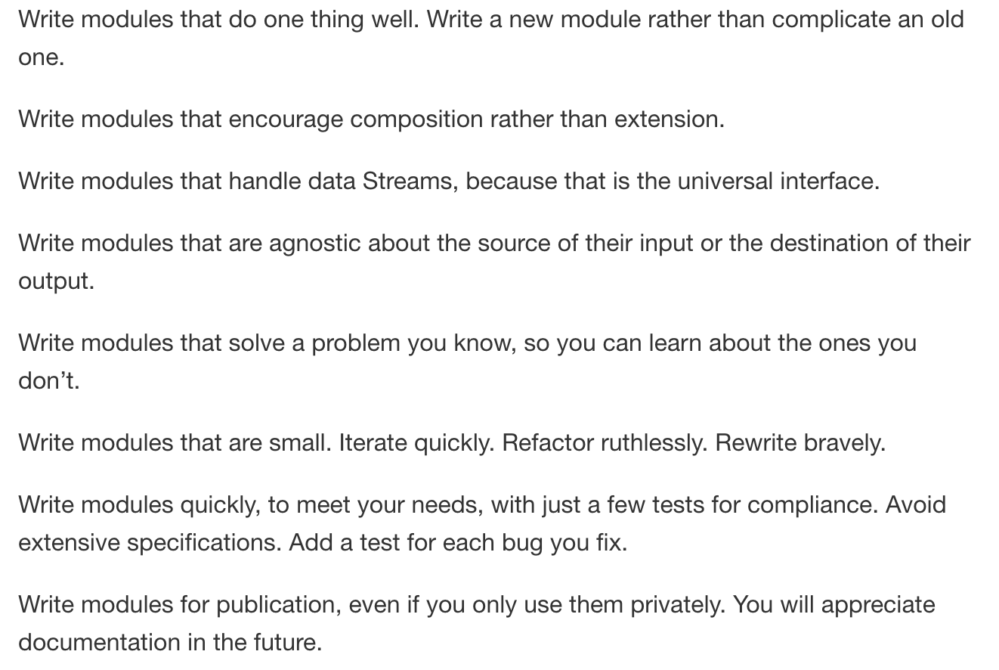
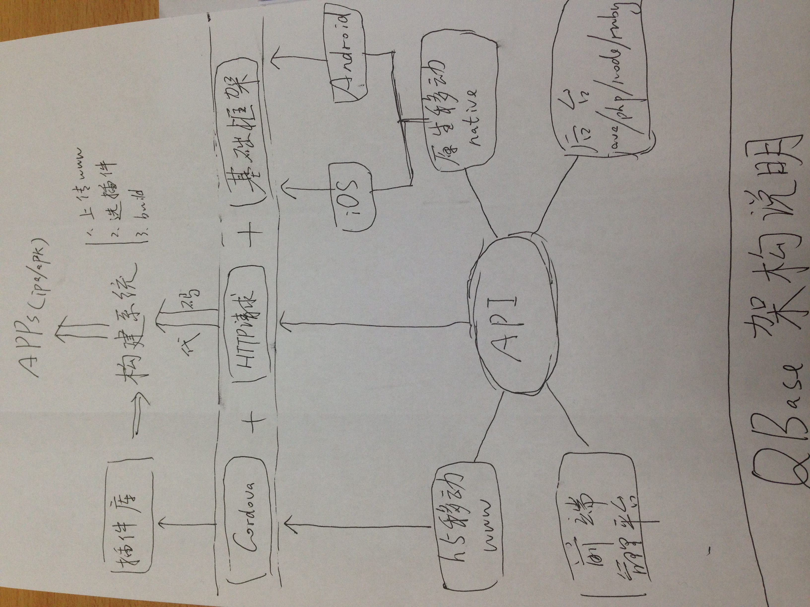
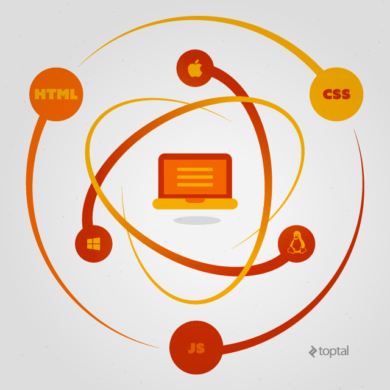
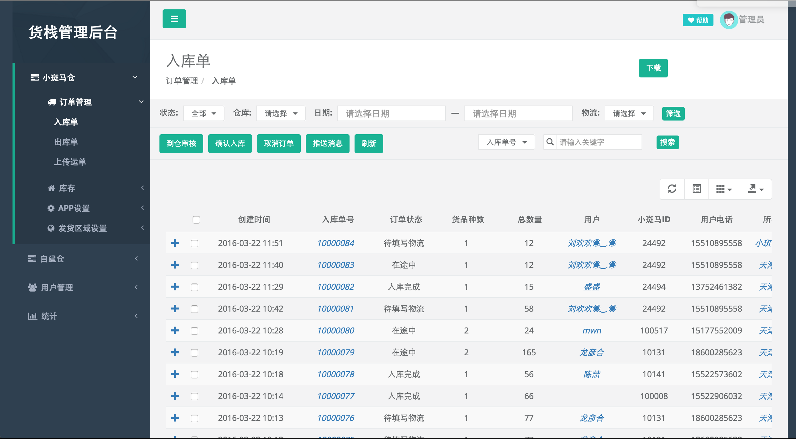

# 全栈工程师之路-Node.js

高可用架构专用


## 主要内容

1. Why Node.js ？
  - 历史
  - 槽点
  - 架构平衡和选择
  - 企业级
2. 我眼中的Node.js核心
3. 快速开发实践
4. 全栈 or 全烂 ？
  - 工具链
  - 前端开发4阶段
  - Hybrid开发
  - 跨平台
  - 全栈的可能
5. 未来


最近比较火的2016年开发者调查了，Node.js和全栈、以及和js相关的技术都有不错的战绩，这次给大家分享一下《全栈工程师之路-Node.js》，准备的还不够充分，水平也有限，大家见谅啊

http://stackoverflow.com/research/developer-survey-2016


## 讲师介绍

桑世龙，目前在天津创业，空弦科技 CTO，开源项目Moajs作者，公司目前使用技术主要是Node.js，
技术栈算所谓的MEAN（mongodb  + express + angular + node）；
曾在新浪，网秦等工作过；
算全栈程序员吧，带过前端、后端、数据分析、移动端负责人、做过首席架构师、技术总监，目前主要从事技术架构 + 招人工作


# Part 1：为什么选用Node.js ？

已经7岁的Node.js，你还熟悉么？

以前？现在？

## 回顾一下2015年Node.js的发展历史

http://i5ting.github.io/history-of-node-js/

### Q1(1季度)

- IO.js 1.0.0 发布
- Joyent 推进建立 Node.js 基金会
  - Joyent, IBM, Microsoft, PayPal, Fidelity, SAP and The Linux Foundation Join Forces to Support Node.js Community With Neutral and Open Governance
- IO.js 和 Node.js 和解提案

### Q2(2季度)

- npm 支持私有模块
- Node 项目领导人 TJ Fontaine 逐步解除核心身份并离开 Joyent 公司
  - A changing of the guard in Nodeland.
- Node.js 和 io.js 在 Node 基金会下合并情况

### Q3(3季度)

- 4.0 版本发布，即新的 1.0 版本

### Q4(4季度)

- Node v4.2.0，首个长期支持版本（LTS）
- Apigee，RisingStack 和 Yahoo 加入 Node.js 基金会
- Node Interactive
  - The first annual Node.js conference by the Node.js Foundation

## 版本帝？

去年

- 从v0.10.35 开始
- 2015-01-14发布了v1.0.0版本（io.js）
- 2.x（io.js）
- 3.x（io.js）
- 2015年09月Node.js基金会已发布Node.js V4.0版 与io.js合并后的第一个版本
- 2015年10月Node.jsv4.2.0将是首个lts长期支持版本
- 年底发布到4.2.4 && 5.4.0
       
       
目前（2016年3月20日）的2个版本

- v4.4.0 LTS（长期支持版本）
- v5.9.0 Stable（稳定版本）


整体来说趋于稳定

- 成立了nodejs基金会，能够让nodejs在未来有更好的开源社区支持
- 发布了LTS版本，意味着api稳定
- 快速发版本，很多人吐槽这个，其实换个角度看，这也是社区活跃的一个体现，但如果大家真的看CHANGELOG，其实都是小改进，而且是边边角角的改进，也就是说nodejs的core（核心）已经非常稳定了，可以大规模使用


## 以前我们总是喜欢拿异步说事儿

Node.js与生俱来的2个特性

- event-driven
- non-blocking I/O

结果，今天。。。各种【异步】。。。烂大街了

异步已经不是明显优势了

## 除了性能，其他都是病？

- 第一、callback hell问题，目前已经很好的解决了，promise/generator/async后面会讲
- 第二、npm已经是开源世界里最大的包管理器了，模块非常丰富（25.6万+）


官方说

```
Node.js' package ecosystem, npm, is the largest ecosystem of open source libraries in the world.
```

以前我们总是喜欢拿异步说事儿，现在我们拿Node.js的强大的生态来炫耀

## 大事儿记

下面介绍点Node.js的大事儿记

### 企业级

- 2014年 nearform [NODE.JS为什么会成为企业中的首选技术](http://www.nearform.com/nodecrunch/node-js-becoming-go-technology-enterprise/)


- 2015年 IBM [收购 StrongLoop，拓展云服务业务](http://www-03.ibm.com/press/us/en/pressrelease/47577.wss)


Node.js基金会的创始成员包括Joyent、IBM、Paypal、微软、Fidelity和Linux基金会


更多参见
https://nodejs.org/en/foundation/members/

对于企业级开发，Node.js是足够的，无论从性能、安全、稳定性等都是非常棒的。

空弦科技做的是基于云仓储的SaaS服务，给中小卖家提供服务，核心系统是进销存+订单池+WMS。目前来看不存在任何问题，稍后会讲我们为啥选择Node.js

### es && babel

- 2015年 Ecma国际大会宣布正式批准ECMA-262第6版，亦即ECMAScript 2015（曾用名：ECMAScript 6、ES6）的语言规范

http://babeljs.io/

babel作为es编译器，已经大量开始使用了，模块做的非常棒，还有人用babel写其他语言编译器

Node.js里在0.12之后才增加es6特性，es7的目前还不支持。

所以在Node.js里使用es里比较高级的特性，是需要babel去编译处理的。

这是node追逐的事实标准

### 微软请求 Node.js 支持 ChakraCore

-  2016年01月22日，[微软请求 Node.js 支持 ChakraCore](https://github.com/nodejs/node/pull/4765)

未来Node.js不只是基于chrome v8内核，它还可以支持更多其他浏览器内核，对生态、效率提升等非常有好处

蔡伟小兄弟的[查克拉benchmark的对比](https://github.com/DavidCai1993/ES6-benchmark)

```
基本结论是 V8 ES5 >> 查克拉 ES6 > 查克拉 ES5 > V8 ES6
```

## 为什么我们选择Node.js ？

先看一下我们的瓶颈在哪里 ？

- 1）人（天津不好招人）

Node.js招不到，好多都是从java转的，前端也不好找，好多也是从java转的，我们相当于从0开始组建团队

- 2）开发速度

创业公司，5分钟要造火箭。。。大家都懂

所以让开发快速进入状态，提高开发速度，对我们来说至关重要

- 3）稳定

在没有专业运维人员的情况下，如何保证系统可用、稳定


于是就引出了我认为的Node.js的好处

- 1）即同样不优化，性能比大部分语言好(天生被黑的优越感，没办法)
- 2）即使优化，也比其他语言简单，比如java
- 3）有足够多的选择和架构的平衡
- 4）如实在不够，java补

## 选择

Node.js给了我们足够的选择空间

### 1）可难可易

- 可以采用面向过程
- 可以面向对象
- 可以函数式

甚至可以用各种编译器coffee、typescript、babel（es）等

对于从0开始的团队来讲，可以先面向过程、然后随着团队的成熟度，一点一点增加难度

### 2）提供好的基础和包管理工具

- 测试相关 tdd/bdd/测试覆盖率
- 规范化 standard、各种lint、hint
- 构建相关 gulp、grunt、webpack，大量插件
- 生成器 yo等
- 包管理工具npm足够简单易用

以上这些都做大型软件的基础，Node.js在这方面做得非常好

### 3）特定场景的快速

很多人把mean组合（比如mean.io）起来，这样做的好处是如果熟悉，开发速度确实会非常快，但确定是难度太大，很少有人能搞的定

metetor模糊了服务端和客户端，是同构的典型应用，对于实时场景是非常高效的。

这种东西都算特定场景的快速，一般不敢轻易上，调优难度非常大，如果有人能cover的住，在初期是非常高效的。

### 4）总结

- 可以简单，可以难
- 可以快、也可以慢
- 可以开发大型软件

还有一个问题就是如果以上不满足咋办？这时就需要架构平衡了

## 架构平衡

先说技术选型的3个思考点

- 在语言层面可以做，那语言层面做
- 如果语言层面搞不定，那就架构层面做
- 如果架构层面也搞不定，这东西就不能用了


各自做各自合适的事儿就好，下面分别举例看看

我们很坦然的面对Node.js的优点和缺点

- 1）语言层面能解决的
  - 已有大量npm上的模块(目前在25.6万个以上) 
  - 自己造轮子(站在海量包上+简单语法+npm=快速)
  - 使用Node.js里的[nan](https://github.com/nodejs/nan)自己包装c/c++轮子

绝大部分需求都可以满足了  

- 2）架构层面能解决的
  - 业务边界、模块拆分、面向服务
  - mq、rpc、cache
  - 运维、监控、自动化

稍微解释一下

- 首先，架构和是不是Node.js写的没关系，是独立的
- 其次，架构师常用的东东有足够的Node.js模块支持，比如mq，像rabbitmq有比较好的node模块支持，像rpc里thrift、grpc、tchannel支持的都不错，我们使用的senecajs，比如redis，我们使用的ioredis，后面做ha都是一样的。
- 合适的场景用合适的东西

有很多东西是Node.js不擅长，又不在架构范畴里的，咋办？

3）如实在不够，java补（严格点，应该叫其他语言补）
  - 比如复杂excel生成
  - 比如apns推送（go做其实也很好，不过除了我，没人能维护。。。）

但凡是java或其他语言里比较成熟的库，可以作为独立服务使用的，都可以做Node.js的支持。避免过多的时间用在早轮子上，影响开发进度

## 效率问题？

执行效率：

- 同样不优化，性能比大部分语言好

开发效率：

- Node.js本身比较简单，开发效率还是比较高的
- 完善的生态，比如测试、工具、npm大量模块

缺少rails一样的大杀器
  
  - scaffold脚手架
  - orm太弱

Node.js的web开发框架express、koa等，简单，小巧，精致，缺点是集成度不够，目前已有的mean或yo或sails等总有某种方面的不满意

所以我们需要做的

- 固化项目结构
- 限定orm
- 自定义脚手架

偏偏Node.js提供了2点，可以让你30分钟写一个脚手架

- cli命令模块，编写非常容易
- 基于js的模板引擎（知名的30+）


## 我们用Node.js做什么？

- api服务
- 前端（moa-frontend）
- SDK（OAuth Provider）
- 辅助开发cli工具

## 目前进度

- 使用0.10.38，开发moajs框架
  - express/mongodb
  - pm2部署
  - 阿里云的slb负载
  - alinode监控
- 前后端分离
  - moa-api
  - moa-frontend
  - moa-h5(未能用)
- 上redis缓存
- 上rabbitmq
- 上senaca作为rpc
- 上kong作为api gateway（todo）
- 上consul做服务发现和配置（todo）
- 上elk作为日志分析处理（todo）
- 使用docker compose作为本地开发环境（todo）
- 线上docker（todo）

技术栈更新

- nodejs 4.x（预计今年6月份）
- koa（generator/co）
- es6/es7(babel)

4.x在内存和性能上都有非常大的提升，新的语言特性上，异步流程和语法上都需要学习，故不急于升级，待人才梯队完善

目前的做法是小步快走

- 一次只上一样新技术
- 形成梯队，即可准备上新东西
- 善用npm，实现3化
  - 模块化
  - 最小化
  - 服务化
  
              
# Part 2：我眼中的Node.js核心


- 1）小而美的哲学
- 2）从LAMP到MEAN
- 3）异步流程控制
- 4）Node.js Web开发
- 5）Node.js 模块开发

时间原因，接下来稍微介绍一下MEAN

## 小而美的哲学

"Small is beautiful"是Unix哲学9条里的第一条，但对Node.js来说，它实在是再合适不过了

http://blog.izs.me/post/48281998870/unix-philosophy-and-nodejs

<!--  -->

- Write modules that do one thing well. Write a new module rather than complicate an old one.
- Write modules that encourage composition rather than extension.
- Write modules that handle data Streams, because that is the universal interface.
- Write modules that are agnostic about the source of their input or the destination of their output.
- Write modules that solve a problem you know, so you can learn about the ones you don’t.
- Write modules that are small. Iterate quickly. Refactor ruthlessly. Rewrite bravely.
- Write modules quickly, to meet your needs, with just a few tests for compliance. Avoid extensive specifications. Add a test for each bug you fix.
- Write modules for publication, even if you only use them privately. You will appreciate documentation in the future.

## 从LAMP到MEAN

MEAN是目前最潮的全栈javascript架构

MEAN是一个Javascript平台的现代Web开发框架总称，它是MongoDB + Express +AngularJS + NodeJS 四个框架的第一个字母组合。它与传统LAMP一样是一种全套开发工具的简称。


从我的角度看

- mysql用mongodb替换，nosql里最像rdbms的，从开发和性能都是有优势的（老毕已经讲过了）
- angular的出现是一个时代，ioc，双向绑定，指令等都曾让无数热血沸腾
- nodejs提供了完全的生态和工具链，你要的它基本都有，感谢npm，早些年nodejs的性能甩php几条街的
- express作为nodejs示范项目，它非常精简，是比较合适的web框架


我为什么选择MEAN架构？

- 成熟、稳定，简单，有问题我们能cover住，所以我们选了nodejs
- 把握趋势，以后nodejs的前景非常看好，尤其先后端统一，全栈方向
- 在架构上可以屏蔽可能风险，不孤注一掷，也不会一叶障目，合理的使用其他语言，只要每个功能都以服务出现，至于它是什么语言写的，并不重要
- 招人成本的性价比相对较高，技术栈新，容易吸引人才

最重要的一件事儿，是当有问题的时候，有人能cover住，在创业初期这是最最重要的事儿。

我的一篇爆款文章《Node.js最新Web技术栈（2015年5月）》https://cnodejs.org/topic/55651bf07d4c64752effb4b1
讲的就是我们用的技术栈


## 异步流程控制

js流程控制的演进过程，分以下5部分

- 1) 回调函数Callbacks
- 2) 异步JavaScript
- 3) Promise/a+规范
- 4) 生成器Generators/ yield(es6)
- 5) Async/ await(es7)


- 目前所有版本都支持Promise/a+规范
- 目前Node.js 4.0 + 支持Generators/ yield
- 目前不支持ES7里的Async/await，但可以通过babel实现

整体来说，对异步流程控制解决的还是比较好的。

详见[Node.js最新技术栈之Promise篇](https://cnodejs.org/topic/560dbc826a1ed28204a1e7de)

## Node.js Web开发

- Node.js Web开发
  - express、koa
  - restify、hapi
  - 其他框架sails、meteor

各种类型web开发都支持的，一般我们采用非restful的使用express、koa更简单

如果是纯restful，可以采用restify、hapi

另外还有快速模拟api的[json-server](https://github.com/typicode/json-server)，对rest支持超方便

## Node.js 模块开发

- Node.js模块开发
  - 普通模块
  - cli
  - 脚手架scaffold
  - c/c++ addons

普通模块和cli模块只是差package.json里的

```
  "preferGlobal": "true",
  "bin": {
    "kp": "kp.js"
  },
```

脚手架scaffold = cli + 模板生成，在Node.js里这2点都非常容易

在Node.js里写c/c++扩展，有nan抽象层，其他就看大家的c/c++水平了

# Part 3：快速开发实践

## 1、业务边界优化

创业公司有很多可变性，要做的系统也无数，如何保证业务系统的边界是非常难的，我们其实走了很多弯路，图-稍后补


## 2、静态api理论


当需求和ue定下来之后，就开始编写静态api，这样app、h5、前端就可以使用静态api完成功能，而后端也可以以静态api为标准来实现，整体效率还是比较高的。


另外还有基于api生成http请求的思考（未完成）



## 3、api约定


api的最佳实践


- http://developer.github.com/v3/ （严格的restful）
- 微博API (可读性强，相对比较传统)

我们采用的微博API类似的，约定结构也是类似的

res.api is an express middleware for render json api , it convention over api format like this :

```
{
  data: {

  },
  status: {
    code : x,
    msg  : 'some message'
  }
}
```

详见[客户端 API 开发总结](https://cnodejs.org/topic/552b3b9382388cec50cf6d95)

## 4、约定结构


和java开发里的目录结构类似，该分层的分层，适当的按照express/koa增加中间件、路由等目录，便于开发

## 5、使用npm模块化

- 使用npmjs的private私有模块（目前做法）
- 使用npm的本地模块开发方法（测试和部署都非常快）
- 搭建npm私服（todo）

```
hz-api-cloud-admin
hz-api-cloud-order
hz-api-cloud-stock
hz-api-private
hz-api-private-admin
hz-dao-cloud
hz-dao-private
hz-dao-usercenter
hz-doc-api
hz-frontend
hz-mq 
hz-sms
hz-usercenter
xbm-sdk
hz-api-admin
hz-api-crm
hz-api-order
hz-api-statistics
hz-api-stock
hz-config
hz-dao
hz-doc
```


## 6、编写生成器

在web开发里，写了moajs生成器，类似于rails

```
moag order name:string password:string
```

其他开发，如iOS开发里模型校验非常烦,于是写了一个json2objc命令行工具，读取json，生成oc代码，可以节省不少时间

## 7、Moajs框架和前后端分离

- 前端：[moa-frontend](https://github.com/moajs/moa-frontend)
  - public下面的采用nginx做反向代理
  - 其他的采用express+jade精简代码（ajax与后端交互）
- 后端：[moa-api](https://github.com/moajs/moa-api)

### 1）、moa生成器

即上面讲的生成器scaffold

### 2）、moa-frontend

技术栈

- express
- jade
- bootstrap、bootstrap-table
- jquery
- gulp
- nginx

### 3）、moa-api

技术栈

- [base2(mirco kernel)](https://github.com/base-n/base2-core)
- [mongoose](https://github.com/Automattic/mongoose)
- [bluebird](https://github.com/petkaantonov/bluebird)
- [res.api](https://github.com/moajs/res.api)

Features

- 自动加载路由
- 支持mongodb配置
- 集成mongoosedao，快速写crud等dao接口
- 自带用户管理
- 使用jsonwebtoken做用户鉴权
- 支持migrate测试
- 支持mocha测试
- 默认集成res.api，便于写接口
- 集成supervisor，代码变动，自动重载
- gulp自动监控文件变动，跑测试
- gulp routes生成路由说明
- 使用log4js记录日志

### 4）、总结

从开发效果上看，还是非常快的，非常稳定的

更多参见我写的[《Moajs框架演进之路》](https://cnodejs.org/topic/567e2388aacb6923221de469)


## 其他

- 《从0开始写Node.js框架》

# Part 4：全栈 or 全烂 ？

## Node.js相关工具

- grunt/gulp/fis/webpack
- bower/spm/npm
- tdd/bdd cucumber/mocha
- standard
- babel/typescript/coffee

## 前端开发4阶段

- html/css/js（基础）
- jQuery、jQuery-ui，Extjs（曾经流行）
- Backbone（mvc），Angularjs、Vuejs（当前流行）
- React组件化（未来趋势）、Vuejs

Vuejs综合Angular和React的优点，应该是下一个流行趋势

## Hybrid开发

Hybrid混搭开发是指使用html5技术开发的跨浏览器应用，并最终可以将html5.js.css等打包成apk和ipa包的开发方式。它也可以上传到应用商店，提供给移动设备进行安装。它最大的好处是通过h5开发一次，就可以在多个平台上安装。

未来的2点

- js一统天下（nodejs做后端，传统web和h5使用javasctipt，更智能的工具如gulp，更简单的写法如coffeescript等）
- h5大行其道（网速变快，硬件内存增长）

## 跨平台

 1）c/s架构到b/s架构

这个大部分都清楚，不多说

 2）移动端：加壳


在浏览器上做文章，把页面生成各个移动端的app文件

 3）PC端：继续加壳



一样是延续浏览器做文章，不过这次把页面生成各个PC平台的可执行文件

- node-webkit is renamed [NW.js](https://github.com/nwjs/nw.js)
- [Electron](https://github.com/atom/electron) - Build cross platform desktop apps with web technologies

目前比较火的编辑器[atom](https://github.com/atom/atom)和[vscode](https://github.com/Microsoft/vscode)都是基于Electron打包的。

 4） 组件化：统一用法


React的出现影响最大的是jsx的出现，解决了长久以来组件化的问题，

- 我们反复的折腾js，依然无法搞定
- 我们尝试OO，比如extjs
- 我们最终还是找个中间格式jsx

单纯的React只是view层面的，还不足以应用，于是又有Redux

核心概念：Actions、Reducers 和 Store，简单点说就是状态控制

然后再结合打包加壳，变成app或可执行文件

- iOS、Android上用Cordova
- PC上使用Electron

总结

- 组件定义好（React）
- 控制好组件之间的状态切换（Redux）
- 打包或加壳（Cordova or Electron）

这部分其实组件化了前端，那么能否用这样的思想来组件化移动端呢？

再看[react-native](https://github.com/facebook/react-native)

A framework for building native apps with React. http://facebook.github.io/react-native/

简单点说，就是用React的语法来组件化iOS或Android SDK。

它们都在告诉我们，你们以后就玩这些组件就好了，你不需要知道复杂的SDK是什么

 5）当下流行玩法


[Medis](https://github.com/luin/medis) is a beautiful, easy-to-use Redis management application built on the modern web with Electron, React, and Redux. It's powered by many awesome Node.js modules, especially ioredis and ssh2.


技术点

- 使用Node.js模块
- 使用Webpack构建
- 使用React（视图） + Redux（控制逻辑）
- 使用Electron加壳打包

亲，你看到未来了么？


6）总结

讲了node工具，前端4阶段，hybrid，各种跨平台，目前就是为了介绍Node全栈的各种可能，下面讲一下如何能做到Node全栈？

## 如何全栈？

全栈核心

- 后端不会的ui（界面相关）
- 前端不会的db（业务相关）

只要打通这2个要点，其他就比较容易了

1）从后端转

做后端的人

- 对数据库是比较熟悉，无论mongodb，还是mysql、postgres
- 对前端理解比较弱，会基本的html，css，模板引擎等比较熟悉

```
4阶段循序渐进，build与工具齐飞
```

前端开发4阶段，我的感觉是按照顺序，循序渐进

- html/css/js（基础）
- jQuery、jQuery-ui，Extjs（曾经流行）
- Backbone，Angularjs（当前流行）、Vuejs
- React（未来趋势）、Vuejs

2）从前端转


从前端往后端转，api接口非常容易学会，像express、koa这类框架大部分人一周就能学会，最难的是对db、er模型的理解，说直白点，还是业务需求落地的理解

我们来想想一般的前端有什么技能？

- html
- css（兼容浏览器）
- js会点（可能更多的是会点jquery）
- ps切图
- firebug和chrome debuger会的人都不太多
- 用过几个框架，大部分人是仅仅会用
- 英语一般
- svn/git会一点

那么他们如果想在前端领域做的更深有哪些难点呢？

- 基础：oo，dp，命令，shell，构建等
- 编程思想上的理解（mvc、ioc，规约等）
- 区分概念
- 外围验收，如h5和hybird等
- 追赶趋势，如何学习新东西

以上皆是痛点。


所以比较好的办法

- 玩转npm、gulp这样的前端工具类（此时还是前端）
- 使用node做前后端分离（此时还是前端）
  - express、koa这类框架
  - jade、ejs等模板引擎
  - nginx
- 玩转【后端】异步流程处理（promise/es6的(generator|yield)/es7(async|await)）
- 玩转【后端】mongodb、mysql对应的node模块

从我们的经验看，这样是比较靠谱的。

https://github.com/moajs/moa-frontend

就是最简单前后端分离，里面没有任何和db相关，

技术栈

- express
- jade
- bootstrap，bootstrap-table
- jquery
- gulp
- nginx

一般的前端都非常容易学会，基本2周就已经非常熟练了，我的计划是半年后，让他们接触【异步流程处理】和【数据库】相关内容，学习后端代码，就可以全栈了

<!--  -->

### 从移动端转

移动端分

- native原生开发
- hybrid混搭式开发

原生开发就是iOS用oc/swift,Android用java或scala等，就算偶尔嵌入webview，能玩js的机会也非常好少

所以移动端转全栈的方法，最好是从cordova（以前叫phonegap）开始做hybrid开发。

- 只要关注www目录里的h5即可，比较简单
- 如果h5不足以完成的情况下，可以编写cordova插件，即通过插件让js调用原生sdk里功能
- cordova的cli可以通过npm安装，学习npm的好方法
- 学习gulp构建工具

只要入了h5的坑，其实就非常好办了。

- 然后h5、zeptojs、iscroll、fastclick等
- 然后微信常用的，如weui、vux（vue+weui）、jmui（react+weui）
- 然后可以玩点框架，比如jquery mobile，sencha touch
- 然后可以玩点高级货，ionicframework（基于angularjs、cordova）
- 然后前端4阶段，依次打怪升级
- 然后node

这个基本上是我走的路，从2010年写iOS、做phonegap（当时是0.9.3）、一路走到现在的总结吧

# Part 5：未来

可能是一场春梦，也可能一个变革机遇，我们更相信它是变革机遇，拭目以待吧

谢谢大家


- [前端资源教程](https://cnodejs.org/topic/56ef3edd532839c33a99d00e#56f146920a5a2cfb3ad14928)
- [JavaScript 资源大全中文版](https://cnodejs.org/topic/56e8c95dcf7763a6045c4ae4)


# Q & A

